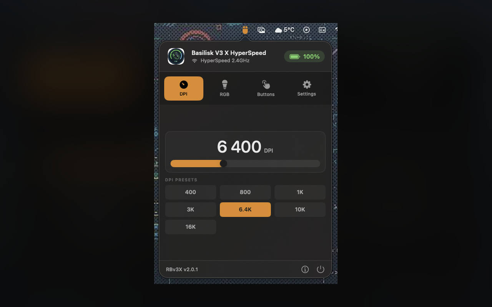
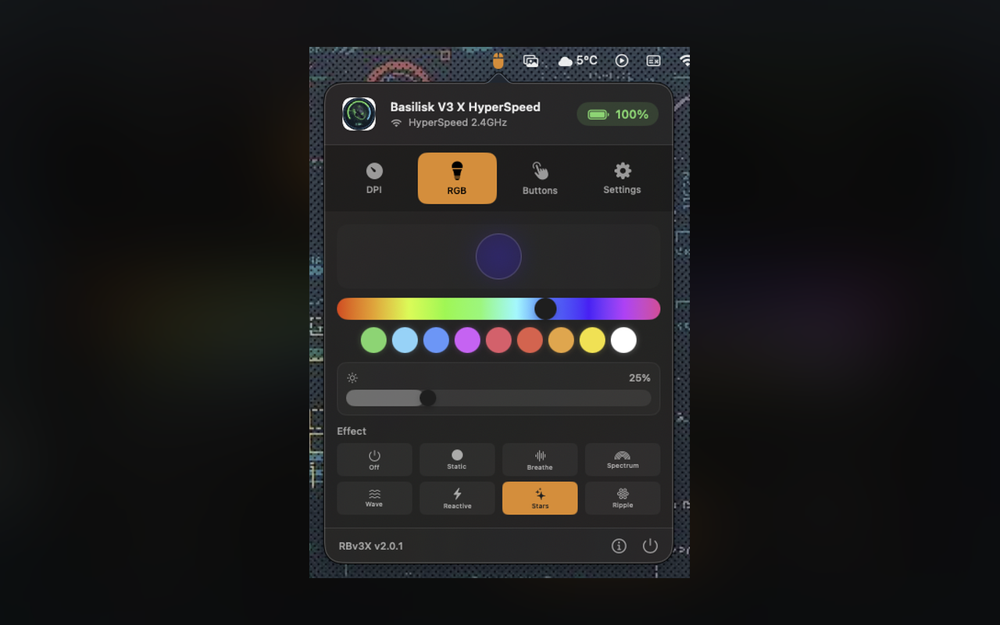
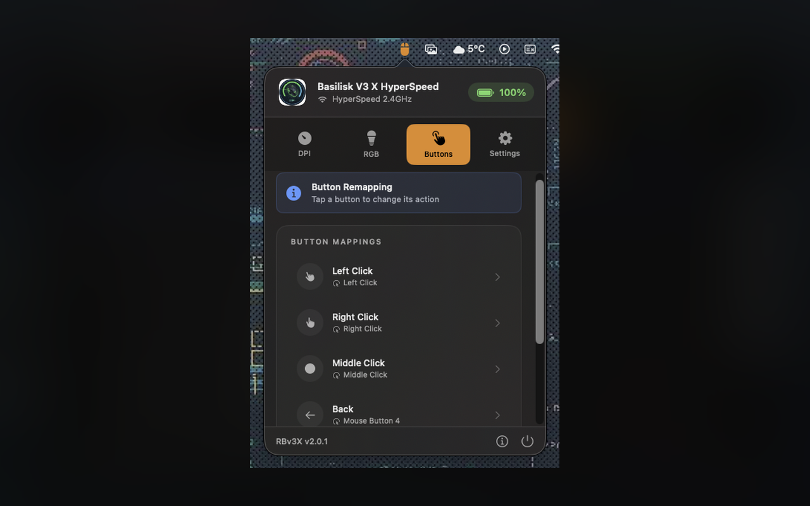
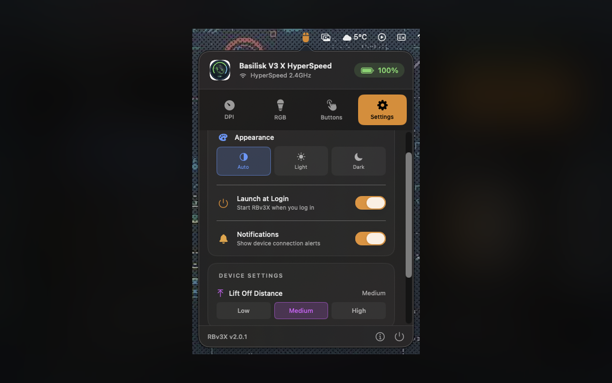

  

<h1 align="center">RBv3X</h1>

  <strong>Razer Basilisk v3 Series Settings Tool</strong>

  
  

  
  
  
  

---

Configure your Razer Basilisk V3 mouse on macOS. DPI control, RGB lighting, button mapping - all from your menu bar. A lightweight, native app built with SwiftUI.

---

## Features

### DPI Control
Set mouse sensitivity from 100 to 35,000 DPI. Create custom presets for different tasks - low DPI for precise work, high DPI for fast navigation.

### RGB Lighting
Customize your mouse lighting effects. Choose from static colors, breathing effects, spectrum cycling, and more. Match your setup or create your own unique style.

### Button Mapping
Remap mouse buttons to system actions, keyboard shortcuts, or media controls. Configure your mouse exactly how you want it.

### Battery Status
Monitor battery level for wireless models. See charging status at a glance with the visual battery indicator.

### Menu Bar App
Lives in your menu bar - always one click away. No dock icon clutter. Clean, minimal interface.

### Native macOS Experience
Built with SwiftUI for a truly native interface. Supports Dark Mode and integrates seamlessly with macOS.

---

## Screenshots

<table>
  <tr>
    <td></td>
    <td></td>
  </tr>
  <tr>
    <td></td>
    <td></td>
  </tr>
</table>

---

## Supported Devices

| Device | DPI | Connection |
|--------|-----|------------|
| **Basilisk V3** | 26,000 | USB |
| **Basilisk V3 35K** | 35,000 | USB |
| **Basilisk V3 Pro** | 30,000 | USB / HyperSpeed |
| **Basilisk V3 Pro 35K** | 35,000 | USB / HyperSpeed |
| **Basilisk V3 X HyperSpeed** | 18,000 | HyperSpeed / Bluetooth |

---

## Requirements

- macOS 14.0 Sonoma or later
- Apple Silicon or Intel processor
- Razer Basilisk V3 series mouse

---

## Legal

- [Privacy Policy](privacy.md)

---

  <strong>Your mouse. Your settings.</strong>

  &copy; 2005 Michał Koźlik. All rights reserved.

  <em>Not affiliated with Razer Inc.</em>

