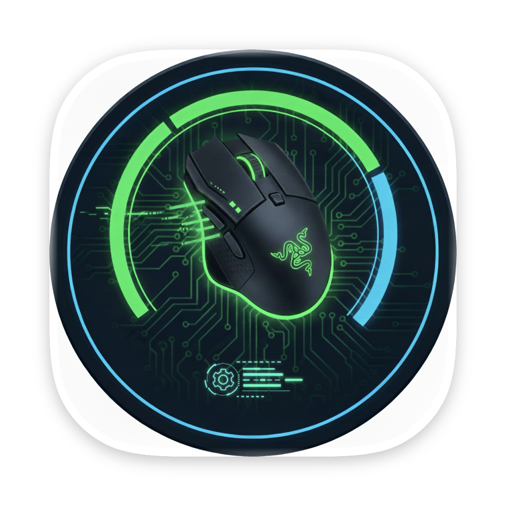

# Support

  

<h2 align="center">RBv3X Support</h2>

---

## Getting Help

If you're experiencing issues with RBv3X or have questions about the app, we're here to help.

### Report a Bug or Issue

Found a bug? Please report it on our GitHub Issues page:

**[Open an Issue on GitHub](https://github.com/7MichalKozlik7/RBv3X/issues)**

When reporting an issue, please include:
- Your macOS version
- Your Razer mouse model
- Steps to reproduce the problem
- Any error messages you see

### Feature Requests

Have an idea for a new feature? We'd love to hear it! Submit feature requests on GitHub:

**[Request a Feature](https://github.com/7MichalKozlik7/RBv3X/issues/new)**

---

## Frequently Asked Questions

### Why isn't my mouse detected?

Make sure your Razer Basilisk V3 series mouse is:
1. Properly connected (USB cable or 2.4GHz dongle)
2. Powered on (for wireless models)
3. Not being used by another application

Try disconnecting and reconnecting the mouse.

### Which mice are supported?

RBv3X supports:
- Razer Basilisk V3 (wired)
- Razer Basilisk V3 Pro (wireless)
- Razer Basilisk V3 X HyperSpeed (wireless)

### Do I need Razer Synapse?

No! RBv3X is a standalone application that communicates directly with your mouse. Razer Synapse is not required and can be uninstalled.

### Are my settings saved?

Yes, your DPI, RGB, and button settings are saved locally on your Mac and applied when you connect your mouse.

### Does the app collect my data?

No. RBv3X does not collect, store, or transmit any personal data. All settings are stored locally on your device. See our [Privacy Policy](privacy.md) for details.

---

## System Requirements

- **macOS:** 13.0 Ventura or later
- **Processor:** Apple Silicon or Intel
- **Hardware:** Razer Basilisk V3 series mouse

---

## Contact

For general inquiries or feedback, you can reach us through:

- **GitHub:** [github.com/7MichalKozlik7/RBv3X](https://github.com/7MichalKozlik7/RBv3X)
- **Issues:** [GitHub Issues](https://github.com/7MichalKozlik7/RBv3X/issues)

---

## Legal

- [Privacy Policy](privacy.md)
- [Terms of Service](terms.md)
- [EULA](eula.md)

---

  &copy; 2025 Michal Kozlik. All rights reserved.

